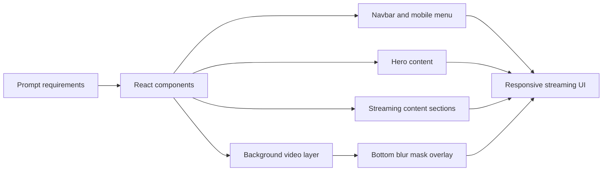

# Cinematic Streaming Experience

Cinematic Streaming Experience is a polished React and Tailwind streaming homepage built from a detailed UI prompt. It keeps the cinematic full-viewport hero, then extends the app with scrollable Movies, TV Series, Editor's Pick, Interviews, and User Reviews sections. It uses a real background video, glass navigation controls, staggered blur-fade animation, responsive mobile navigation, and a visible personal credit: `Built By Nagadeepak`.

## Problem Statement

Recruiter-facing portfolios benefit from high-quality frontend pieces that prove taste, responsiveness, and implementation discipline. This project turns a precise product prompt into a runnable React interface with real navigation depth, reusable content sections, and responsive behavior that can be shown on GitHub, reused in a portfolio, and referenced in a LinkedIn build post.

## Features

- Full-screen fixed background video with object-cover
- Bottom-only blur overlay using CSS mask, without a dark gradient overlay
- Reusable `liquid-glass` button treatment
- Staggered blur-fade-up animation across nav and hero elements
- Desktop navbar with five links and glass controls
- Responsive mobile menu with animated hamburger-to-close icon
- Bottom-aligned cinematic hero copy and metadata row
- Scrollable Movies poster rail
- TV Series episode cards
- Editor's Pick detail band
- Interviews content rows
- User Reviews rating and quote cards
- Visible `Built By Nagadeepak` credit near the top navigation

## Tech Stack

- React 18
- Vite
- Tailwind CSS
- Lucide React icons
- Inter font from Google Fonts

## Architecture



## Folder Structure

```text
.
├── POST_CAPTION.md
├── README.md
├── index.html
├── package.json
├── postcss.config.js
├── src
│   ├── App.jsx
│   ├── index.css
│   └── main.jsx
├── tailwind.config.js
└── vite.config.js
```

## Setup

From this project folder:

```bash
npm install
```

## How to Run

Start the local dev server:

```bash
npm run dev
```

Build the production bundle:

```bash
npm run build
```

Preview the production build:

```bash
npm run preview
```

## Demo Instructions

For a recruiter or reviewer:

1. Open the project folder in GitHub.
2. Review the README and `src/App.jsx`.
3. Run `npm install` and `npm run dev`.
4. Confirm the hero fills the first viewport.
5. Use the navbar to jump to Movies, TV Series, Editor's Pick, Interviews, and User Reviews.
6. Resize below `1024px` and check the mobile menu.
7. Verify the top nav shows `Built By Nagadeepak`.

## Verification

Current local verification:

```bash
npm run build
```

Browser checks should confirm:

- desktop first viewport renders as a cinematic hero
- nav links scroll to matching content sections
- background video layer fills the viewport
- bottom blur overlay is visible without a dark gradient
- mobile menu opens and closes
- content sections remain readable on mobile
- `Built By Nagadeepak` is visible at the top

## Future Improvements

- Add a poster fallback image for environments that block video autoplay.
- Add real poster image assets for each movie card.
- Add Playwright visual checks for desktop and mobile viewports.
- Promote the component into a standalone showcase repository if it becomes part of the public portfolio.

## Recruiter-Friendly Summary

This project demonstrates frontend implementation quality: responsive React layout, Tailwind styling, glassmorphism, animation timing, media layering, scroll navigation, section composition, and faithful execution from a precise UI prompt.
