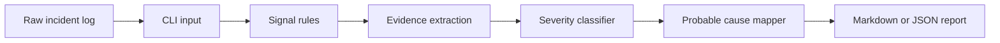

# Incident Log Summarizer

Incident Log Summarizer is a small DevOps/AI-style CLI that turns raw incident logs into a structured report with severity, evidence, probable cause, and runbook-style next actions.

The project is intentionally runnable without paid API keys. It uses deterministic signal detection first, which makes it useful in CI, production-support handoffs, and recruiter demos. An LLM layer can be added later for natural-language wording, but the core triage stays testable.

## Problem Statement

Production incidents often start with noisy logs from Kubernetes, CI/CD, application services, or upstream dependencies. Engineers need to quickly answer:

- What failed?
- How severe is it?
- Which log lines prove it?
- What should be checked first?
- What should be handed off to the next engineer?

This tool summarizes those signals into a Markdown or JSON report that is easy to paste into an incident channel, ticket, or runbook.

## Features

- Detects common DevOps failure patterns:
  - Kubernetes restart loops
  - OOMKilled and memory pressure
  - readiness/liveness probe failures
  - DNS and network timeouts
  - TLS/certificate failures
  - authorization failures
  - database connectivity issues
  - rate limiting
  - possible secret exposure
- Produces Markdown or JSON output
- Includes evidence line numbers
- Provides practical next actions
- Supports CI threshold checks with `--fail-on`
- Runs locally, in Docker, and in GitHub Actions

## Tech Stack

- Python 3.10+
- Standard-library CLI with `argparse`
- `pytest` for tests
- Docker for portable execution
- GitHub Actions for CI

## Architecture



## Folder Structure

```text
.
├── Dockerfile
├── POST_CAPTION.md
├── README.md
├── examples
│   ├── ci_failure.log
│   ├── clean_deploy.log
│   └── k8s_incident.log
├── pyproject.toml
├── src
│   └── incident_log_summarizer
│       ├── __init__.py
│       ├── __main__.py
│       ├── analyzer.py
│       └── cli.py
└── tests
    └── test_analyzer.py
```

## Setup

From this project folder:

```bash
python3 -m venv .venv
source .venv/bin/activate
python -m pip install -e ".[test]"
```

## How to Run

Summarize a Kubernetes incident log:

```bash
incident-log-summarizer examples/k8s_incident.log
```

Return JSON for automation:

```bash
incident-log-summarizer examples/ci_failure.log --format json
```

Fail a CI step when severity is high or above:

```bash
incident-log-summarizer examples/k8s_incident.log --fail-on high
```

Read from stdin:

```bash
cat examples/k8s_incident.log | incident-log-summarizer -
```

## Sample Output

```markdown
# Incident Summary: examples/k8s_incident.log

- Severity: **HIGH**
- Lines analyzed: `5`
- Probable cause: Kubernetes workload health or rollout failure

## Recommended Actions

- Inspect health endpoint behavior, startup time, dependency availability, and rollout history.
- Review memory limits, recent traffic, heap usage, and restart counts before scaling.
- Confirm the target service is running, listening on the expected port, and reachable from the caller.
```

## Tests

```bash
pytest
```

## Docker

Build the image:

```bash
docker build -t incident-log-summarizer .
```

Run the demo:

```bash
docker run --rm -v "$PWD/examples:/logs:ro" incident-log-summarizer /logs/k8s_incident.log
```

## GitHub Actions

This project includes a standalone GitHub Actions workflow template. If this folder is used as its own repository, the workflow runs:

- package install
- pytest
- CLI demo
- Docker image build

Workflow path:

```text
.github/workflows/ci.yml
```

## Demo Instructions

For a recruiter or reviewer:

1. Open this folder in GitHub.
2. Read the problem statement and architecture diagram.
3. Review `examples/k8s_incident.log`.
4. Run `incident-log-summarizer examples/k8s_incident.log`.
5. Check `tests/test_analyzer.py` to see how the behavior is verified.
6. Open the GitHub Actions run for `incident-log-summarizer-ci`.

## Future Improvements

- Add optional OpenAI or local LLM summarization for more natural incident narratives.
- Export SARIF or GitHub Step Summary output for CI annotations.
- Add Kubernetes event parsing from `kubectl describe pod`.
- Add OpenTelemetry trace/log correlation examples.
- Add a small FastAPI endpoint for team integrations.

## Recruiter-Friendly Summary

This project demonstrates practical DevOps automation, production-support thinking, CI/CD hygiene, Docker packaging, test coverage, and AI-ready summarization design without relying on fake claims or hardcoded secrets.
