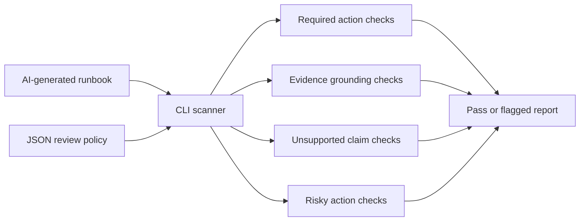

# LLM Runbook Drift Check

LLM Runbook Drift Check is a small AI/DevOps CLI that reviews an AI-generated incident runbook before a team trusts it. It checks whether the response includes required operational actions, cites enough incident-specific evidence, and avoids risky or unsupported claims.

The project is intentionally deterministic and does not require paid API keys. It is useful as a guardrail around LLM-generated support notes, incident handoffs, and runbook drafts.

## Problem Statement

AI-generated runbooks can save time during production incidents, but they can also skip evidence, invent root causes, or suggest dangerous mitigations. Teams need a lightweight review step that asks:

- Did the response mention the required checks?
- Is it grounded in the actual incident signals?
- Did it invent an unsupported root cause?
- Did it suggest a risky action such as deleting resources or disabling controls?

## Features

- Checks required operational actions from a JSON policy
- Counts incident-specific evidence terms
- Flags unsupported claims with regular expressions
- Flags risky mitigation guidance
- Produces text or JSON output
- Uses only the Python standard library
- Includes safe and risky sample AI runbook responses
- Includes deterministic tests

## Tech Stack

- Python 3.10+
- Standard library only
- JSON policy file
- Markdown sample responses
- `unittest` for tests

## Architecture



## Folder Structure

```text
.
|-- README.md
|-- POST_CAPTION.md
|-- llm_runbook_drift_check.py
|-- sample_policy.json
|-- sample_safe_runbook.md
|-- sample_risky_runbook.md
`-- tests
    `-- test_llm_runbook_drift_check.py
```

## How to Run

From this project folder:

```bash
python3 llm_runbook_drift_check.py --policy sample_policy.json sample_safe_runbook.md
```

Expected result:

```text
PASS: runbook response is grounded enough for review
```

Run the risky sample:

```bash
python3 llm_runbook_drift_check.py --policy sample_policy.json sample_risky_runbook.md
```

Expected result:

```text
FLAGGED: 9 issue(s)
```

Return JSON for CI or another automation step:

```bash
python3 llm_runbook_drift_check.py --policy sample_policy.json sample_risky_runbook.md --format json
```

## Tests

```bash
python3 -m py_compile llm_runbook_drift_check.py
python3 -m unittest discover -s tests
```

## Demo Instructions

For a recruiter or engineering reviewer:

1. Open `sample_policy.json` to see the required production-support checks.
2. Compare `sample_safe_runbook.md` and `sample_risky_runbook.md`.
3. Run the CLI against both files.
4. Review `tests/test_llm_runbook_drift_check.py` to see the behavior is verified.

## Future Improvements

- Add SARIF output for GitHub code scanning annotations.
- Add a GitHub Actions workflow template for PR-based AI runbook review.
- Add support for multiple incident policies in one folder.
- Add optional LLM scoring after deterministic checks pass.
- Add a small web UI for support teams to paste runbook drafts.

## Recruiter-Friendly Summary

This project demonstrates AI safety guardrails, incident-response thinking, DevOps workflow design, testable automation, and practical production-support engineering without hardcoded secrets or live cloud dependencies.
