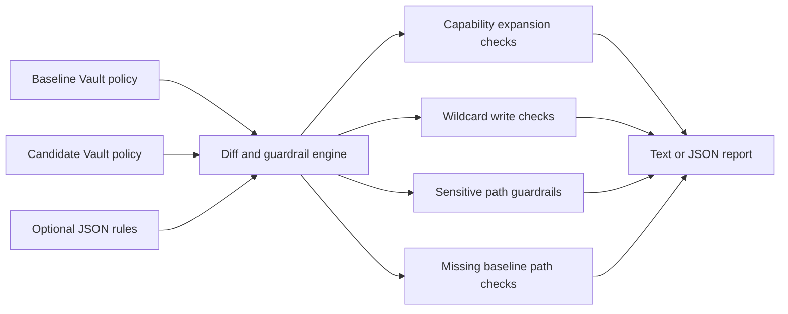

# Vault Policy Drift Check

Vault Policy Drift Check is a deterministic DevSecOps CLI that reviews a candidate Vault ACL policy against an approved baseline before it gets merged or applied. It highlights newly introduced write privileges, risky wildcard paths, and dangerous access on sensitive Vault endpoints.

The project is designed for platform and security teams that want a lightweight guardrail in pull requests, change reviews, or release pipelines without needing a live Vault cluster.

## Problem Statement

Vault policy changes are easy to underestimate during reviews. A single wildcard path or added `sudo` capability can quietly expand blast radius across secrets, auth, or system endpoints. Teams need a small review tool that answers:

- Did this policy gain new write-like access?
- Did it introduce wildcard writes?
- Did it broaden access on sensitive `sys/*`, `auth/*`, or production secret paths?
- Did it silently remove a baseline path that should still exist?

## Features

- Compares a candidate Vault ACL policy against a baseline policy
- Detects capability expansion on existing paths
- Flags new write-capable paths not present in baseline
- Flags wildcard paths with write-like capabilities
- Applies built-in guardrails for sensitive Vault path families
- Supports optional custom JSON rules for local policy conventions
- Produces text or JSON output for humans or CI systems
- Includes deterministic samples and automated tests

## Tech Stack

- Python 3.10+
- Python standard library only
- Vault ACL policy samples in HCL-style syntax
- `unittest` for local verification

## Architecture



## Folder Structure

```text
.
|-- README.md
|-- POST_CAPTION.md
|-- baseline_policy.hcl
|-- sample_safe_policy.hcl
|-- sample_risky_policy.hcl
|-- rules.json
|-- vault_policy_drift_check.py
`-- tests
    `-- test_vault_policy_drift_check.py
```

## How to Run

From this project folder:

```bash
python3 vault_policy_drift_check.py --baseline baseline_policy.hcl sample_safe_policy.hcl
```

Expected result:

```text
PASS: no risky Vault policy drift detected
```

Run the risky sample:

```bash
python3 vault_policy_drift_check.py --baseline baseline_policy.hcl --rules rules.json sample_risky_policy.hcl
```

Expected result:

```text
FLAGGED: 15 issue(s)
```

Return JSON for a CI gate or PR annotation step:

```bash
python3 vault_policy_drift_check.py --baseline baseline_policy.hcl sample_risky_policy.hcl --format json
```

## Tests

```bash
python3 -m py_compile vault_policy_drift_check.py
python3 -m unittest discover -s tests
```

## Demo Instructions

1. Review `baseline_policy.hcl` to see the approved access pattern.
2. Compare `sample_safe_policy.hcl` and `sample_risky_policy.hcl`.
3. Run the CLI on both candidate files.
4. Switch to `--format json` to see how the output could feed CI or policy review tooling.

## Future Improvements

- Add SARIF output for GitHub code scanning style annotations.
- Support policy bundles with multiple files and namespaces.
- Add checks for mount-specific conventions such as KV v2 metadata/data parity.
- Export Markdown summaries for security review comments.
- Add a project-local GitHub Actions workflow template for pull-request policy review.

## Recruiter-Friendly Summary

This project shows platform-security thinking, deterministic DevSecOps automation, policy review discipline, and practical infrastructure guardrails that are easy to explain in interviews and easy to promote into a standalone repository later.
